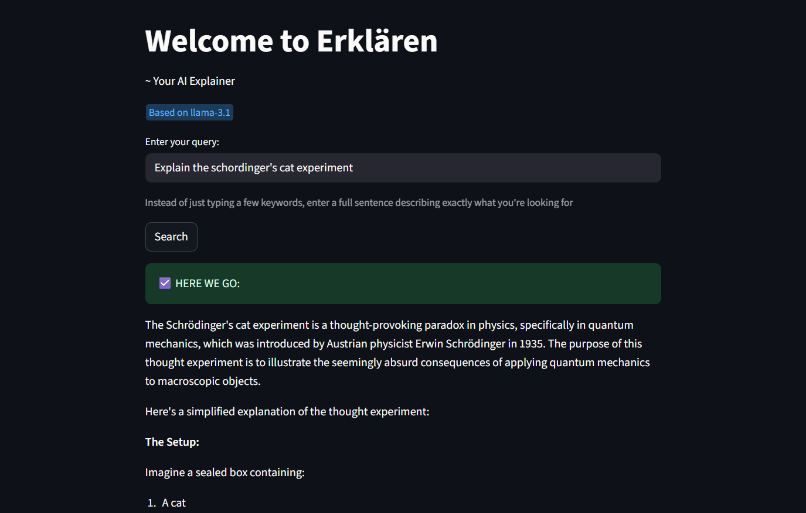

# 📜 Erklären


A simple Streamlit app that uses Pydantic AI agents and Tavily search to answer user queries with up-to-date information.

## Features
- Ask questions and get answers using Groq LLMs and Tavily search.
- Streamlit web interface for easy interaction.

## Example Case



## Setup

1. **Clone the repository**
2. **Install dependencies:**
   ```sh
   pip install -r requirements.txt
   ```
3. **Create a `.env` file** in the project root with your API keys:
   ```env
   GROQ_API_KEY=your_groq_api_key_here
   TAVILY_API_KEY=your_tavily_api_key_here
   ```
4. **Run the app:**
   ```sh
   streamlit run app.py
   ```

## Environment Variables
- `GROQ_API_KEY`: Your Groq LLM API key ([get one here](https://console.groq.com/)).
- `TAVILY_API_KEY`: Your Tavily search API key ([get one here](https://app.tavily.com/)).

## Usage
- Open the Streamlit app in your browser (usually at http://localhost:8501).
- Enter your query and get instant answers!

## Notes
- Do **not** commit your `.env` file or API keys to version control.
- For any issues, ensure your API keys are valid and your environment is set up as described above. 
